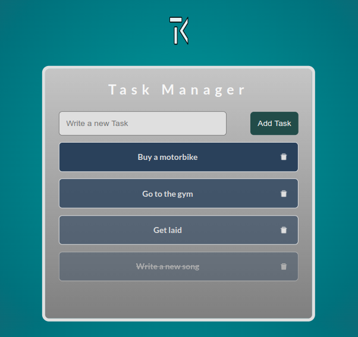

# Tasks Web App (Practice of the React Framework)

## Description & Functionality
- File structure by Vite
- Typography(imported, woff2 format) : Lato-bold
- Uses prefered color scheme for dark and light mode defined by user system
- Using PropTypes for validation
- Using [React Icons library 5.3.0](https://react-icons.github.io/react-icons/) for icons
- Using form with input and button
- Using [UUID package 11.0.2](https://www.npmjs.com/package/uuid) to generate unique IDs
- Using Tooltips on Icons
- Using LOCAL STORAGE persistence

## Online Link
<!-- [github Pages Link](https://tiborkopca.github.io/Javascript2024-DeusExMachina-SmartphoneCalculator/) -->
<!-- [Vercel](https://javascript2024-deus-ex-machina-smartphone-calculator-rc8ei62ah.vercel.app/) -->

## Screenshots

## Author
[@TiborKopca](https://github.com/TiborKopca)